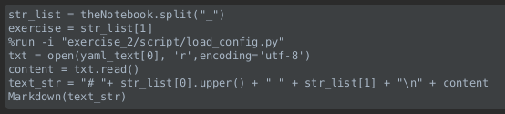

# Esercizi sottosequenze (crescenti e decrescenti)

### Import

| Libreria | Utilizzo                                       | 
|----------|------------------------------------------------|
| Ipysheet | serve per visualizzare le tabelle da compilare |
| Pandas   | serve per riempire le tabelle    
| re       | serve per creare regular expression per modificare le stringhe |
| os       | serve per creare, leggere, modificare i file in un path    |

Le altre librerie sono già spiegate?

Negli import troviamo anche i verificatori, in questo caso troviamo i nomi per i verificatori delle sottosequenze crescenti,
per i verificatori decrescenti sostituire i nomi, i verificatori verranno spiegati in seguito.\
N.B. i verificatori per le sequenze crescenti e decrescenti sono i medesimi, l'unica differenza è il verso del segno per i controlli.

### Bottone run

Questa parte di codice serve per creare un bottone che permette di lanciare il run delle celle sottostanti per inizializzare il notebook.
Ovviamente la cella di input e questa cella vengono lanciate automaticamente all'apertura del notebook

### Javascript per inizializzare

Questa cella contenente codice javascript viene lanciata all'apertura del notebook, serve ad estrarre il nome del notebook per riutilizzarlo successivamente.

### Inizializzazione notebook

Questa cella utilizza il nome del notebook estratto prima per inizializzare il testo.
Lancia il comando run per caricare il file di configurazione (spiegato prima, link)
Carica il testo dal file yaml (come già spiegato) e lo mostra a video.

### Tabella di supporto

### example 1: (è il primo esercizio dei due notebook)
 